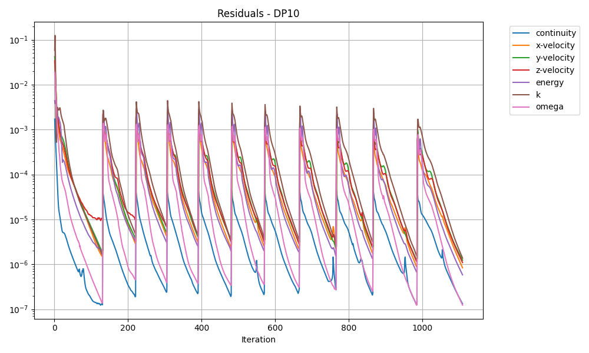
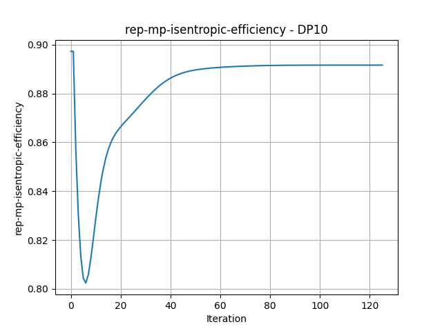
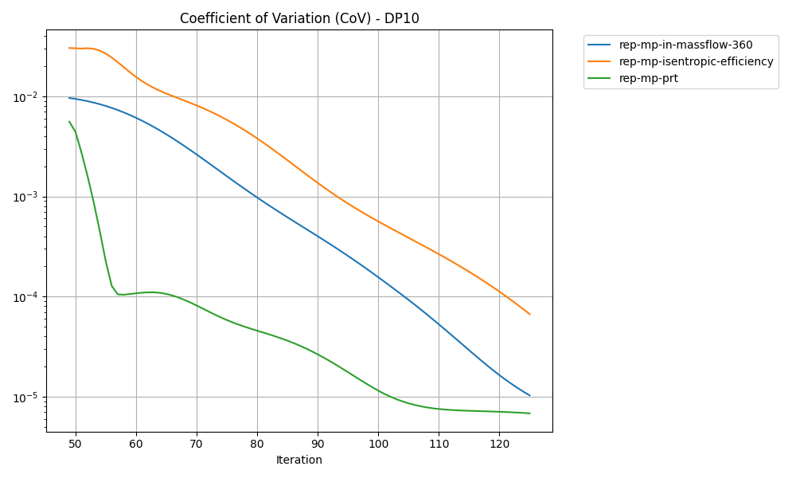

# Set up the configuration file

This document explains how to adjust the configuration file for a single case study or parametric studies.

The configuration file includes the following sections:

- ```"launching"```: Launching options for the Fluent session. See [Launching options](#launching-options).
- ```"functions"```: Subroutines for numerical setup, postprocessing, and parametric studies. See [Functions](#functions).
- ```"cases"```: Definition of a single case study. See [Single case study](#single-case-study).
- ```"studies"```: Definitions of parametric studies. See [Parametric studies](#parametric-studies).

## Launching options

In the ```"launching"``` section, specify Fluent launching options, such as the version, number of processes, and whether to use a single- or double-precision solver.

- ```"workingDir"```: Fluent working directory. If this option is not set, the script uses the directory of the configuration file as the Fluent working directory.
- ```"fl_version"```: Fluent version, e.g. `"25.1.0"`
- ```"noCore"```: Number of cores/processes for the Fluent session.
- ```"precision"```: Whether to use a double-precision solver. The default is ```true```. If ```false```, a single-precision solver is used.
- ```"show_gui"```: Whether to show a GUI during simulation. The default is ```true```.
- ```"py"```: Whether to enable the Python console. The default is ```false```.
- ```"gpu"```: Whether to enable the GPU solver. Check current model limitations. The default is ```false```.
- ```"exitatend"```: Whether to close the Fluent session after the script finishes. The default is ```true```.
- ```"ptw_cleanup"```: Whether to remove files from the Fluent working directory after exiting the Fluent session. The default is ```false```. If ```true```,
these files are removed: ```fluent\*.trn``` and ```\*slurm\*```. If you define
  ```"ptw_cleanup"``` as a list of strings, the defined files are removed. For example, ```"ptw_cleanup": ["myFile.txt","*.log"]```.

To run Fluent on Linux or a cluster, you have two options:

- Submit your job to a Slurm queue, such as ```"queue_slurm": "ottc01"```, with a maximum waiting time in seconds, such as ```"queue_waiting_time": 36000```. The default waiting time is ```600``` seconds. Use ```"additional_args"``` for extra launching options, such as ```"-scheduler_ppn=4 -scheduler_gpn=4"```. Other options are identical to the usual launching options.
- Hook onto an existing Fluent session. See the **How to Run** section in the repository's [README.md](https://github.com/ansys-internal/pyturbowizard/blob/main/README.md#how-to-run). Use ```"serverfilename"``` to specify a server file name. When hooking onto an existing Fluent session, only the ```"workingDir"``` launching option is used.

```
"launching":
    {
      "workingDir": "<PathToFluentWorkingDir>",
      "fl_version": "25.1.0",
      "noCore": 8,
      "serverfilename": "server-info.txt",
      "precision": "double",
      "show_gui":  true
    },
```

For examples of launching configurations, see the [launcherConfig_examples.json](../doc/examples/ConfigFileTemplates/launcherConfig_examples.json) file.

## Functions

In the ```"functions"``` section, specify subroutines for numerical setup, postprocessing, and parametric studies:

```
"functions":
    {
      "setup": "setup_compressible_01",
      "numerics": "numerics_bp_tn_2305",
      "initialization": "init_hybrid_01",
      "postproc": "post_01",
      "parametricstudy": "study_01"
    },
```

The following functions and corresponding options are available:

- ```setup```:
  - Specify the setup function.
  - Available functions:
    - ```"setup_compressible_01"```: Standard setup for compressible fluids. This is the default.
    - ```"setup_incompressible_01"```: Standard setup for incompressible fluids.
    - ```"setup_compressible_woBCs"```: Reduced setup function for compressible fluids. This function sets only material and physics, not boundary conditions.
    - ```"setup_incompressible_woBCs"```: Reduced setup function for incompressible fluids. This function sets only material and physics, not boundary conditions.
- ```numerics```:
  - Specify the numeric settings.
  - Available functions:
    - ```"numerics_defaults"```: Fluent default settings.
    - ```"numerics_bp_tn_2305"```: Turbo best practice settings from May 2023 with Fluent default discretization schemes and Green-Gauss node-based gradient discretization scheme. This is the default.
    - ```"numerics_bp_tn_2305_lsq"```: Turbo best practice settings from May 2023 with the LSQ gradient discretization scheme.
    - ```"numerics_bp_all_2305"```: Turbo best practice settings from May 2023 with all discretization schemes explicitly set to second order.
    - ```"numerics_defaults_pseudo_timestep"```: Default numerics with pseudo-transient vp-coupling.

- ```initialization```:
  - Specify the initialization settings.
  - Available functions:
    - ```"init_standard_01"```: Standard initialization using inlet data as reference.
    - ```"init_standard_02"```: Standard initialization using 0 velocity, 0.01 TKE, 0.01 Omega, inlet temperature, and initial gauge pressure.
    - ```"init_hybrid_01"```: Hybrid initialization using initial gauge pressure.
    - ```"init_fmg_01"```: FMG initialization using standard ```"init_standard_01"``` for pre-initialization. This is the default.
    - ```"init_fmg_02"```: FMG initialization using standard ```"init_standard_02"``` for pre-initialization.
    - ```"init_fmg_03"```: FMG initialization using standard ```"init_hybrid_01"``` for pre-initialization.

- ```postproc```:
  - Specify the postprocessing function.
  - Available functions:
    - ```"post_01"```: Standard postprocessing. This is the default.

- ```parametricstudy```:
  - Specify the parametric study function.
  - Available functions:
    - ```"study_01"```: Standard parametric study. This is the default.

- ```parametricstudy_post```:
  - Specify the function for evaluating the parametric study results.
  - Available functions:
    - ```"study_post_01"```: Operating point maps for each monitor point (value over mass/volume flow). This is the default. For each design point, these actions are taken:
      - Generate Residual-Plot of residual development for each design point.
      - Plot monitor properties against iteration number, each design point starts from iteration 0.
        - Generate monitor-point plots of monitor-point values for each design point.
        - Generate CoV plot for monitored properties of each design point (starting from iteration 50).

      Examples of plots follow.

      

      

      

      


**Notes:**

- If the ```"functions"``` section is not defined, the script uses the default functions. Define this section only if you want to use non-default functions.
- You can also specify a ```"function"``` section in the definition of each case. For more information, see [Cases](#cases).

## Single case study

When running the script from outside Fluent, you can also use the YAML file format for the configuration file.

The configuration file serves as the input file for the boundary conditions and provides the numeric and simulation setups needed to run the main script.

To run a single case study, the configuration file must contain a ```"launching"``` object to start a Fluent session. For more information, see [Launching options](#launching-options).

### Cases

In the ```"cases"``` section, specify different case setups for the script to run. For example, you can specify different meshes and numerical settings.

```
 "cases": {
      "Case_1": {
        "caseFilename": "Case_1",
        "meshFilename": "Case_1_mesh",
        "profileName_In": "InProfile.csv",
        "profileName_Out": "",
        "expressionTemplate": "expressionTemplate_compressor_comp.tsv",
        "gravity_vector": [0.0, 0.0, -9.81],
        "rotation_axis_direction": [0.0, 0.0, 1.0],
        "rotation_axis_origin": [0.0, 0.0, 0.0],
        "isentropic_efficiency_ratio": "TotaltoTotal"
        ...
      },
      "Case_2": {
      ....
      }
```

First, specify different general case parameters, such as the final ```"caseFilename"``` and the initial ```"meshFilename"```.

Supported file types for meshes are DEF, CGNS, MSH, and CAS. Make sure that the mesh file is located in the Fluent working directory.

You can provide MSH and CAS files as a list like this: ```"meshFilename": ["mesh1.msh","mesh2.msh"]```. When a list is used, the files are imported in the order in which they are specified.

Optional objects are:

- ```"functions"```: Special functions for the specific case. If no special functions are defined, the default or global functions are used (if defined in the root path of your configuration file). For more information, see [Functions](#functions).
- ```"gravity_vector"```: Vector defining gravity, such as ```[0.0, 0.0, -9.81]```. By default, no vector is set, which means that gravity is turned off.
- ```"rotation_axis_direction"```: Vector defining the axis direction. The default is ```[0.0, 0.0, 1.0]```.
- ```"rotation_axis_origin"```: Vector defining the axis origin. The default is ```[0.0, 0.0, 0.0]```.
- ```"isentropic_efficiency_ratio"```: Calculation of isentropic efficiency. Supported arguments are ```"TotalToTotal"```, ```"TotalToStatic"```, and ```"StaticToStatic"```.
- ```"skip_execution"```: Whether to skip the execution of the case. The default is ```false```.

You can hook additional journal files to the setup/solution procedure using the following keywords in the case dictionary. These keywords expect a list like this: ```['myJournal1.jou', 'myJournal2.jou']```.

- ```"post_meshimport_journal_filenames"```: Run journal files after the mesh has been imported (for example defining unsupported boundary conditions).
- ```"pre_init_journal_filenames"```: Run journal files before initializing the solution.
- ```"pre_solve_journal_filenames"```: Run journal files before the solver starts.
- ```"pre_exit_journal_filenames"```: Run journal files before exiting Fluent (for example for custom postprocessing).

#### Profiles

Specify a profile for your inlet or outlet boundaries by providing the ```"profileName"``` in your Fluent working directory. Restrictions exist when using profiles:

- Inlet:
  - Specify profiles for total pressure, total temperature, and absolute velocity using these naming conventions:
    - Profile name: ```"inlet-bc"```
    - Total pressure: ```"pt-in"```
    - Total temperature: ```"tt-in"```
    - Velocity directions in cylindrical coordinates: ```"vrad-dir","vrad-dir","vax-dir"```
- Outlet:
  - Specify a profile for static pressure using these naming conventions:
    - Profile name: ```"outlet-bc"```
    - Static pressure: ```"p-out"```

**Note**: If you want to use the CSV table format for the profile input, Fluent expects the file to have a CSV file extension.

Here is an example snippet for an inlet profile data table in CSV format:

```
[Name]
inlet-bc

[Data]
radius, pt-in, tt-in, vax-dir, vrad-dir, vtang-dir
6.6247E-02, 5.4357E+04, 2.8787E+02, 9.9025E-01, 7.4542E-02, 4.1016E-02
...
```

#### Expression templates

Next, choose your ```expressionTemplate```. There are expression templates available for compressors, fans, pumps, turbine and cascade setups, as well as for compressible and incompressible setups:

- ```expressionTemplate_cascade_comp.tsv```: For cascades or non-turbo-machinery applications, compressible fluids.
- ```expressionTemplate_compressor_comp.tsv```: For compressors, compressible fluids.
- ```expressionTemplate_compressor_incomp.tsv```: For compressors, incompressible fluids.
- ```expressionTemplate_fan_comp.tsv```: For fans, compressible fluids.
- ```expressionTemplate_fan_incomp.tsv```: For fans, incompressible fluids.
- ```expressionTemplate_pump_incomp.tsv```: For pumps, incompressible fluids.
- ```expressionTemplate_turbine_comp.tsv```: For turbines, compressible fluids.
- ```expressionTemplate_turbine_incomp.tsv```: For turbines, incompressible fluids.

```
 "Case_1": {
       ...
       "expressions": {
          "GEO_IN_No_Passages": "1",
          "GEO_IN_No_Passages_360": "1",
          "GEO_OUT_No_Passages": "1",
          "GEO_OUT_No_Passages_360": "1",
          "BC_pref":	"0 [Pa]",
          "BC_omega":	"17000 [rev / min]",
          "BC_IN_pt":	"",
          "BC_IN_p_gauge": 	"58000 [Pa]",
          "BC_IN_Tt":	"",
          "BC_IN_TuIn":	"0.05",
          "BC_IN_TuVR":	"10",
          "BC_OUT_p":	"60000 [Pa]"
         },
      ...
```

### Boundary conditions

Now, specify values for your boundary conditions and geometric expressions in your expression template. Make sure that you leave the corresponding values blank if you use profile data.

Available boundary conditions follow.

- Geometric
  - ```"GEO_IN_No_Passages"```: Number of inlet passages in the computational domain.
  - ```"GEO_IN_No_Passages_360"```: Total number of inlet passages.
  - ```"GEO_OUT_No_Passages"```: Number of outlet passages in the computational domain.
  - ```"GEO_OUT_No_Passages_360"```: Total number of outlet passages.
- General
  - ```"BC_pref"```: Reference pressure.
  - ```"BC_omega"```: Rotational velocity.
- Inlet
  - ```"BC_IN_p_gauge"```: Initial gauge pressure.
  - ```"BC_IN_TuIn"```: Turbulent intensity (from 0 to 1).
  - ```"BC_IN_TuVR"```: Turbulent viscosity ratio.
  - ```"BC_IN_Tt"```: Total temperature.
  - ```"BC_IN_MassFlow"```: Mass flow inlet boundary condition.
  - ```"BC_IN_pt"```: Total pressure inlet boundary condition.
  - ```"BC_IN_VolumeFlow"```: Volume flow inlet boundary condition (mass flow inlet).
    - ```"BC_VolumeFlowDensity"```: Fluid density of inlet volume flow.
- Outlet
  - ```"BC_OUT_p"```: Static pressure outlet boundary condition.
  - ```"BC_OUT_MassFlow"```: Mass flow outlet boundary condition.
  - ```"BC_OUT_ECMassFlow"```: Exit-corrected mass flow outlet boundary condition.
    - ```"BC_ECMassFlow_pref"```: Exit-corrected mass flow reference pressure.
    - ```"BC_ECMassFlow_tref"```: Exit-corrected mass flow reference temperature.
  - ```"BC_OUT_VolumeFlow"```: Volume flow outlet boundary condition (mass flow inlet).
    - ```"BC_OUT_VolumeFlowDensity"```: Fluid density of outlet volume flow.

**Note:** If you want to use profile data for the inlet or outlet, you must still define a corresponding expression. However, you can specify a dummy value. For example, you might specify a profile for outlet pressure like this:

```"BC_OUT_p": "-1 [Pa]"```

#### Domain mapping

In the ```"locations"``` section, map the different regions of your mesh accordingly. Note that every location input is a list, which means that you can map multiple regions. For example, ```["inlet1","inlet2"]```.

You can also specify interfaces as follows:

- General connection under ```"bz_interfaces_general_names"```
- Mixing-plane models under ```"bz_interfaces_mixingplane_names"```
- No pitch-scale interfaces under ```"bz_interfaces_no_pitchscale_names"```
- Pitch-scale interfaces under ```"bz_interfaces_pitchscale_names"```
- Periodic interfaces under ```"bz_interfaces_periodic_names"```

```
"Case_1": {
        ...
        "locations": {
                  "cz_rotating_names": ["a-rotor-1"],
                  "bz_inlet_names": ["inlet1","inlet2"],
                  "bz_outlet_names": ["outlet"],
                  "bz_walls_counterrotating_names": ["a-rotor-1-shroud"],
                  "bz_walls_rotating_names": [],
                  "bz_walls_freeslip_names": ["a-rotor-1-default"],
                  "bz_interfaces_periodic_names": {
                    "a-rotor-periodic-interface-1": {
                        "side1": "a-rotor-1-to-a-rotor-1-periodic-1-side-1",
                        "side2": "a-rotor-1-to-a-rotor-1-periodic-1-side-2"
                      },
                    "b-stator-periodic-interface-1": {
                        "side1": "b-stator-1-to-b-stator-1-periodic-1-side-1",
                        "side2": "b-stator-1-to-b-stator-1-periodic-1-side-2"
                      }
                  },
                  "bz_interfaces_mixingplane_names": {
                    "a-rotor-1-b-stator-1-mpm": {
                      "side1": "b-stator-1-to-a-rotor-1-side-1",
                      "side2": "b-stator-1-to-a-rotor-1-side-2"
                    }
                  "bz_interfaces_no_pitchscale_names": {
                    "c-stator-2-to-b-stator-1-nps": {
                      "side1": "c-stator-2-to-b-stator-1-side-1",
                      "side2": "c-stator-2-to-b-stator-1-side-2"
                    },
                  "bz_interfaces_pitchscale_names": {
                    "c-stator-2-to-d-rotor-2-ps": {
                      "side1": "c-stator-2-to-d-rotor-2-side-1",
                      "side2": "c-stator-2-to-d-rotor-2-side-2"
                    }
                  },
                  "bz_interfaces_general_names": {
                    "a-rotor-1-tip": {
                      "side1": "a-rotor-1-to-a-rotor-1-internal-side-1",
                      "side2": "a-rotor-1-to-a-rotor-1-internal-side-2"
                    }
                  },
                  "bz_walls_torque": ["r1-blade","r1-shroud","r1-hub"],
                  "bz_ep1_Euler": ["b-stator-1-to-a-rotor-1-side-1"],
                  "bz_ep2_Euler": ["c-stator-2-to-b-stator-1-side-1"],
                  ...
```

**Notes**:

- ```"bz_walls"```: Change boundary condition to type walls.
- ```"bz_walls_torque"```: All walls to account for when calculating a reference torque.
- ```"bz_ep1_Euler"```/```"bz_ep2_Euler"```: Inlet (1) and outlet (2) evaluation planes for calculating the efficiency based on the Euler turbine equation.
- Periodic interfaces must be conformal for the turbo topology setup to function properly.

In the ```"locations"``` section, define a turbo topology for postprocessing in Fluent. For different mesh regions (such as rotors and stators), create separate topologies.

```
...
"tz_turbo_topology_names":{
            "a-rotor-1-topology":{
              "tz_shroud_names": ["a-rotor-1-shroud"],
              "tz_hub_names": ["a-rotor-1-hub"],
              "tz_inlet_names": ["inlet"],
              "tz_outlet_names": ["b-stator-1-to-a-rotor-1-side-2"],
              "tz_blade_names": ["a-rotor-1-blade"],
              "tz_theta_periodic_names":["a-rotor-periodic-interface-1"]
            },
            "b-stator-1-topology":{
              "tz_shroud_names": ["b-stator-1-shroud"],
              "tz_hub_names": ["b-stator-1-hub"],
              "tz_inlet_names": ["b-stator-1-to-a-rotor-1-side-1"],
              "tz_outlet_names": ["outlet"],
              "tz_blade_names": ["b-stator-1-blade"],
              "tz_theta_periodic_names":["b-stator-periodic-interface-1"]
            }
          },
          ...
```

**Note;**: If a periodic interface specified under ```"tz_theta_periodic_names"``` is non-conformal, the script automatically handles it.

#### Volume source terms definition

Definintions of volume source terms follow:

```
"source_terms" :{
        "source_m_1":{
            "equation" : "mass",
            "cell_zone" : "passage-main_1",
            "definition" : "0.433[lbm *s^-1]/ (76 * Volume([\"passage-main_1\"]))"
        },
        "source_e_1":{
            "equation" : "energy",
            "cell_zone" : "passage-main_1",
            "definition" : "(0.433[lbm*s^-1])*SpecificHeatCapacity*((348.96[K]-298.15[K])/(76*Volume([\"passage-main_1\"])))"
        }
},
```

- ```"equation"```: Type of the source term.
- ```"cell_zone"```: Domain to apply the source term to.
- ```"definition"```: Expression, where its name is the subdictionary.

### Solution and results setup

#### Solution settings

The ```"solution"``` section specifies convergence criteria and solve settings.

```
       "solution": {
          "reportlist": ["MP_IN_MassFlow_360","MP_OUT_MassFlow_360","MP_Isentropic_Efficiency","MP_PRt"],
          "res_crit": 1.0e-4,
          "cov_list": [
            "MP_Isentropic_Efficiency",
            "MP_IN_MassFlow_360",
            "MP_PRt"
          ],
          "cov_crit": 1.0e-4,
          "iter_count": 10,
          "time_step_factor": 5,
          "runSolver": true
        }
```

- ```"reportlist"```: Expressions for monitoring (plotting and file save). All expressions in ```"reportlist"``` are defined as output parameters.
- ```"res_crit"```: Normalized local residual convergence limit.
- ```"cov_list"```: Parameters to use for the coefficient of variation.
- ```"cov_crit"```: Convergence criteria for the coefficient of variation.
- ```"conv_check_freq"```: Optional argument for defining the convergence check frequency. The default is ```5```.
- ```"tsn"```: Optional argument for explicitly turning on turbo machinery-specific numerics (beta feature).
- ```"time_step_factor"```: Specification of a time step factor (length-scale-method=conservative), automatic calculation of the pseudo-time step.
- ```"pseudo_timestep"```: Direct specification of the pseudo-time step (with no usage of ```"time_step_factor```).
- ```"iter_count"```: Maximum number of iterations.
- ```"runSolver"```: Whether the simulation should start to run at the end of the setup. The default is ```true```.
- ```"reorder_domain"```: Optional argument that turns on and off domain reordering before initialization. The default is ```true```.

##### Basic report definitions

In the ```"solution"``` section, optionally define basic report definitions with the ```"basic_reports"``` keyword. *Basic* refers to the report definitions being created as surface, volume, force, drag, lift, moment, or flux reports. (For flux reports, only mass flux is supported.)

When using the GPU solver, report definitions from expressions are not yet supported. Thus, using the ```"basic_reports"``` keyword is the only option for monitoring desired quantities for every iteration.

The ```"per_zone"``` keyword is optional. The default is ```false```. With this keyword, you can select if the corresponding definition is separated for all selected surfaces.

```
 "Case_1": {
       "solution": {
           "basic_reports": {
              "IN_massflowave_pt": {
                "scope": "surface",
                "type": "surface-massavg",
                "zones": ["inblock-inflow"],
                "variable": "total-pressure"
              },
              "OUT_massflowave_pt": {
                "scope": "surface",
                "type": "surface-massavg",
                "zones": ["outblock-outflow"],
                "variable": "total-pressure"
              },
              "Vol_Ave_pt": {
                "scope": "volume",
                "type": "volume-massavg",
                "zones": ["passage"],
                "variable": "total-pressure"
              },
              "Force_blades_Z": {
                "scope": "force",
                "zones": ["blade","bld-geo-high","bld-geo-low","bld-high"],
                "force_vector": [0,0,1]
                "per_zone": false
              },
              "Drag_blades_Z": {
                "scope": "drag",
                "zones": ["blade","bld-geo-high","bld-geo-low","bld-high"],
                "force_vector": [0,0,1],
                "report_output_type": "Drag Force"
                "per_zone": true
              },
              "Lift_blades_Z": {
                "scope": "lift",
                "zones": ["blade","bld-geo-high","bld-geo-low","bld-high"],
                "force_vector": [0,0,1],
                "report_output_type": "Lift Force"
              },
              "Moment_blades_Z": {
                "scope": "moment",
                "zones": ["blade","bld-geo-high","bld-geo-low","bld-high"],
                "mom_center": [0,0,0],
                "mom_axis": [0,0,1],
                "report_output_type": "Moment"
              },
              "Flux_Mass_In": {
                "scope": "flux",
                "type": "flux-massflow",
                "zones": ["inblock-inflow"]
              }
            },
      ...
```

#### Results

In the ```"results"``` section, set the simulation output data and create span-wise contour plots.

```
        "results": {
          "filename_inputParameter": "inputParameters.out",
          "filename_outputParameter": "outParameters.out",
          "filename_summary": "report.sum",
          "span_plot_var": ["total-pressure","total-temperature","velocity-magnitude"],
          "span_plot_height": [0.2, 0.5, 0.9],
          "pathlines_releaseSurfaces": ["inblock-inflow"],
          "pathlines_var": ["absolute-pressure"],
          "oilflow_pathlines_surfaces": ["blade-ps", "blade-ss", "blade-te"],
          "oilflow_pathlines_var": ["absolute-pressure"]
        }
```

- ```"filename_inputParameter"```: Names of the files containing the input parameters.
- ```"filename_outputParameter"```: Names of the files containing the output parameters.
- ```"span_plot_var"```: Names of the variables to create contour plots for. You can use this command in the Fluent Python console to check for the correct variable names: ```solver.fields.field_data.get_scalar_field_data.field_name.allowed_values()```.
- ```"span_plot_height"```: Relative channel height to create the different variable contour plots at. All variable plots are created for each respective channel height.
- ```"pathlines_releaseSurfaces"```: Surfaces to release pathlines from when creating pathlines.
- ```"pathlines_var"```: Names of the variable to create pathlines for.
- ```"oilflow_pathlines_surfaces"```: Surfaces to generate oil flow pathlines on.
- ```"oilflow_pathlines_var"```: Names of the variables to create oil flow pathlines for. Besides the pathline object, a scene containing the pathline object and a mesh object with surfaces defined in ```"oilflow_pathlines_surfaces"``` is created.

### Additional setup specifications

In the ```"setup"``` section, modify basic settings of your setup. All subelements are optional. If no subelements are defined, Fluent defaults are used.

Available options:

- Special settings for pressure outlet boundary conditions:
  - ```"BC_settings_pout_blendf"```: Pressure blending factor. For example, ```0.05```.
  - ```"BC_settings_pout_bins"```: Number of bins. For example, ```65```.

  **Note:** For older Fluent versions (2023 R1 and 2023 R2), use ```"BC_settings_pout"``` as a keyword for the pressure blending factor and number of bins as a list. For example, ```[0.05, 65]```.

- ```"BC_IN_reverse"```: Whether to prevent reverse flow for pressure inlet boundary conditions. The default is ```false```.
- ```"BC_OUT_reverse"```: Whether to prevent reverse flow for pressure outlet boundary conditions. The default is ```true```.
- ```"BC_OUT_avg_p"```: Whether to use the average pressure specification for the pressure outlet boundary conditions. The default is ```true```.
- ```"turbulence_model"```: Turbulence model to use.
  - Currently only k-omega variants are supported: ```"wj-bsl-earsm"```, ```"standard"```, ```"sst"```,```"geko"```, and ```"bsl"```.
  - Additionally, the following transition models (SST-based) are supported:
    - ```"transition-sst"```: Transition SST model (&gamma;-Re<sub>&theta;</sub>-model): two additional transport equations.
    - ```"transition-gamma"```: Intermittency Transition Model (&gamma;-model): one additional transport equation.
    - ```"transition-algebraic"```: Algebraic Transition Model: zero additional transport equations.

### Working with multiple cases

You can easily add various cases to your configuration file. The script executes the cases step by step.

If you want to copy elements from an existing case to a new case, use the ```"refCase"``` keyword.

Here´s an example for a mesh study:

```
"Case_CoarseMesh": {
        "caseFilename": "myCaseFileName_coarse",
        "meshFilename": "myCaseFileName_coarse.def",
        "functions": {...},
        "expressions": {...},
        "locations": {...},
        "solution": {...},
        "results": {...}
        },

"Case_FineMesh": {
         "refCase": "Case_CoarseMesh",
         "caseFilename": "myCaseFileName_fine",
         "meshFilename": "myCaseFileName_fine.def",
        }
```

The first case (```"Case_CoarseMesh"```) includes all setup definitions. The second case (```"Case_FineMesh"```) uses the ```"refCase"``` keyword to refer to the first case. This means that all objects are copied from ```"Case_CoarseMesh"``` except the elements defined in the second case itself: ```"caseFilename"``` and ```"meshFilename"```.

**Note:** If you specify a new element with subelements (in other words, a new dictionary), all subelements must be specified in the new element.

## Parametric studies

You can find the [Speedline simulation setup example](../doc/examples/Speedline_Example/speedline_example.md) in the repository's ```doc/examples/Speedline_Example``` folder.

To run a parametric study, the configuration file must contain a ```launching``` object for starting a Fluent session. For more information, see [Launching options](#launching-options).

### Study configuration

In the ```"studies"``` section, create different study setups.

```
...
"studies": {
    "Study_1": {
      "overwriteExisting": true,
      "runExistingProject": false,
      "write_data": false,
      "refCaseFilename": "Case_1",
      "updateAllDPs": true,
      "updateFromBaseDP": false,
      "definition": [
        {
          "inputparameters": [
            "BC_OUT_p"
          ],
          "useScaleFactor": [true],
          "valueList": [
              0.95,
              0.9,
              0.85,
              0.8,
              1.025,
              1.03,
              1.04,
              1.05
          ]
```

- ```"skip_execution"```: Whether to execute the study. The default is ```false```.
- ```"overwriteExisting"```: Whether to overwrite an existing study with the same name.
- ```"runExistingProject"```: Whether to use an existing study setup with the same name.
- ```"write_data"```: Whether to save the simulation data for all design points. The default is ```false```. **Note:** If the initialization method is set to ```initMethod: "prevDP"```, data is overwritten.
- ```"simulation_report"```: Whether to capture simulation report data for the design points. The default is ```false```.
- ```"refCaseFilename"```: File name for the reference (base) case, which must be in the Fluent working directory.
- ```"initMethod"```: Initialization method for design points. Options are:
    - ```"base_ini"```: Use the initialization method of the base case. **Note:** This does not work with FMG initialization.
    - ```"baseDP"```: Use the solution of the base design point. This is the default.
    - ```"prevDP"```: Use the solution of the previous design point.

- ```"updateAllDPs"```: Whether to run the study after the setup.
- ```"inputparameters"```: Expressions to vary for the different design points.
- ```"useScaleFactor"```: Whether to use a scale factor from the base case value. You can set this to ```true``` for each selected input parameter.
- ```"valueList"```: List of either the scale factors or specific values to use for the different design points.
